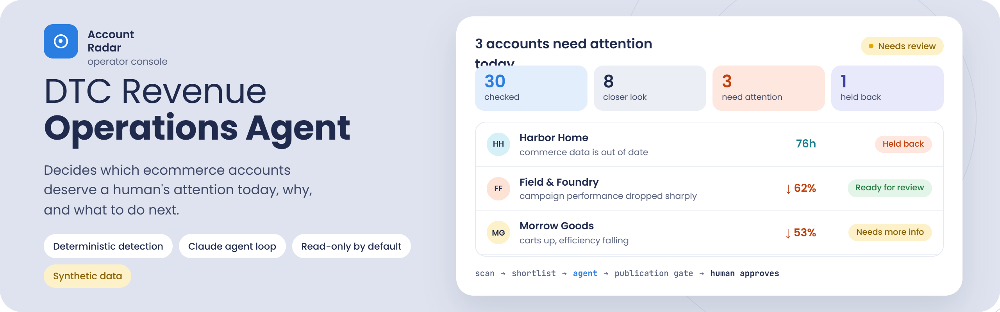
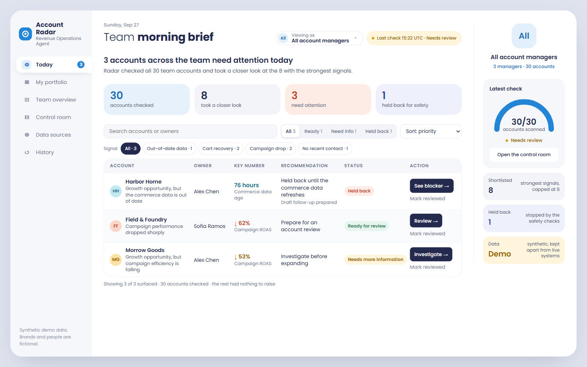
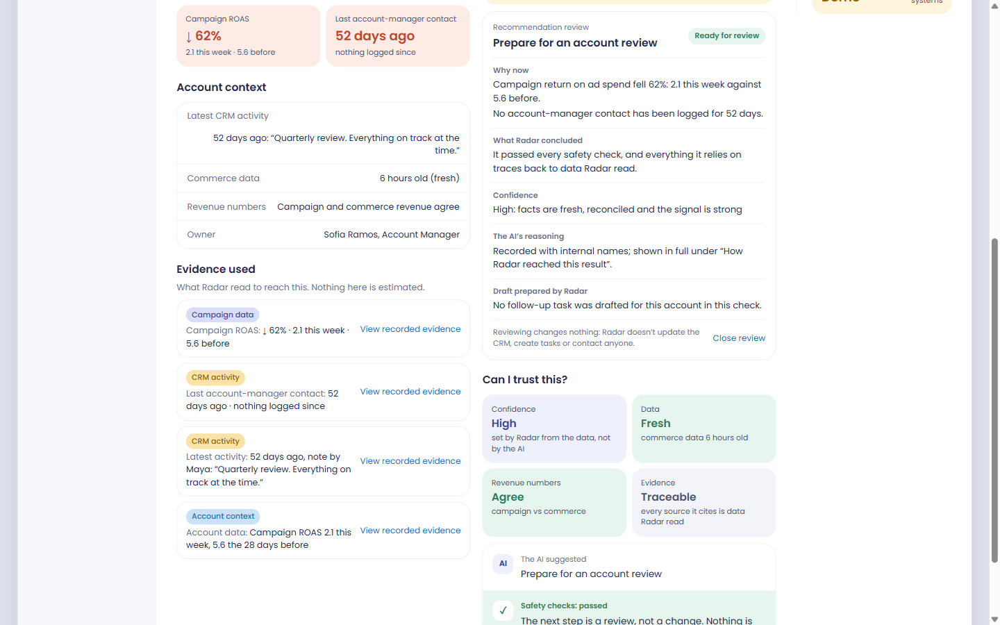
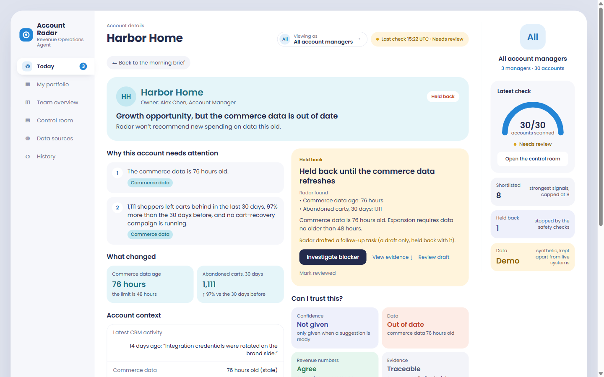
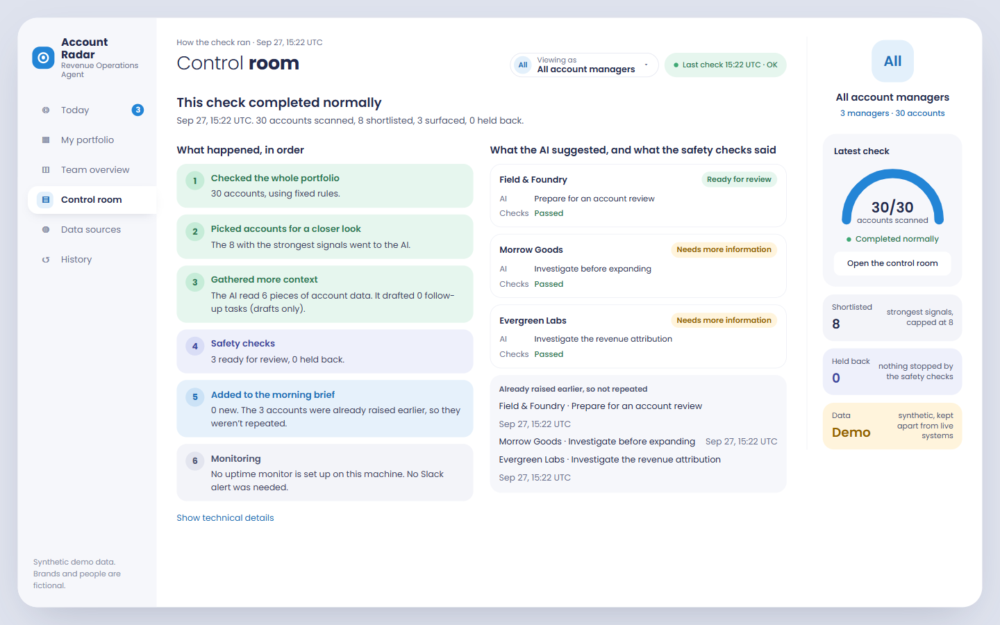

<p align="center">
  
</p>

<p align="center">
  <a href="#what-is-real">
    
  </a>
  <a href="tests">
    
  </a>
  <a href="evals/BASELINES.md">
    
  </a>
  <a href="docs/UNATTENDED_MODE.md">
    
  </a>
</p>

<p align="center">
  
  
  
  
  
  
  
  <a href="LICENSE">
    
  </a>
</p>

# DTC Revenue Operations Agent

An internal AI agent that decides which ecommerce accounts deserve a human's
attention today, why, and what that human should do next.

> A case-study project built with synthetic data. Inspired by public DTC
> lifecycle marketing workflows. Not affiliated with any company.

## What is real

- **Live Claude canaries** against the current prompt, and one **live
  unattended run** ($0.1345, 3 recommendations accepted). Each is recorded
  with its receipt hash in [`evals/BASELINES.md`](evals/BASELINES.md).
- **Real Slack and Healthchecks monitoring** of unattended runs, confirmed end
  to end by the operator ([`docs/UNATTENDED_MODE.md`](docs/UNATTENDED_MODE.md)).
- **Read-only HubSpot, Shopify and Klaviyo adapters.** They are real code
  tested against mocked vendor responses, and they connect only if you
  configure a read-only token. The HubSpot adapter was also verified against a
  real portal (read-only, structure only; not wired into the agent or demo)
  ([`docs/REAL_INTEGRATIONS.md`](docs/REAL_INTEGRATIONS.md)).

## What is synthetic

- The portfolio: 30 brands, their campaigns, commerce data, CRM notes and
  invoices, generated from a fixed seed.
- The outcomes: the nine planted situations and their expected actions.
- The model in offline drills and the demo scenes, which is a scripted client.

## What does not exist

- No connection to any real company's systems.
- No customer data.
- No writes to any business system; writes are designed, not built
  ([`docs/SAFE_WRITE_GATEWAY.md`](docs/SAFE_WRITE_GATEWAY.md)).
- No business-impact claims: nothing here measured revenue or retention.

Architecture: [`docs/ARCHITECTURE.md`](docs/ARCHITECTURE.md) · Console walkthrough:
[`docs/WALKTHROUGH.md`](docs/WALKTHROUGH.md) · One-page card:
[`docs/TECH_CARD.md`](docs/TECH_CARD.md)

## Account Radar: the operator console

Account Radar is the local, read-only console an account manager opens in the
morning: which accounts need attention today, why, what the agent recommends,
and what the safety checks held back. Everything on screen is read from the
run ledger and receipts over the synthetic portfolio.



| Account review | Held back by the stale-data gate | Control room |
|---|---|---|
|  |  |  |

Run it offline (no Claude, no HubSpot, no writes):

```bash
export PYTHONPATH=src                   # PowerShell: $env:PYTHONPATH="src"
python scripts/demo.py healthy          # one offline unattended run into the local ledger
python -m revenue_agent.console         # then open http://127.0.0.1:8765/?as=sofia
```

## Why I built this

Revenue teams managing many ecommerce accounts do not need another chatbot.
They need help deciding where human attention creates the most value, and they
need to be able to trust the answer.

So the design starts from a boundary:

> **The detection is deterministic. The model decides what additional context it
> needs, interprets the facts, ranks what deserves attention today, and writes
> the recommendation with its sources. I would rather have a rule I can test
> than a model I have to trust.**

SQL and Python calculate ROAS, deltas, cart volume, data freshness and revenue
reconciliation. The model may quote a metric a tool returned, but it never
calculates or derives one. It investigates, prioritises and recommends, and
everything it returns is treated as untrusted until it passes the publication
gate.

## Design principles

1. Calculate facts outside the LLM.
2. Detect signals deterministically; the model never scans the portfolio.
3. Let the agent decide what extra context it needs.
4. Read-only by default: four read tools, one proposal tool, zero tools that
   write to any business system or database.
5. A human approves every business-system side effect.
6. Define tolerances before seeing outcomes.
7. Escalate conflicting or stale data instead of guessing.
8. Attach sources to every recommendation, and verify they exist.
9. Confidence is derived from facts, never generated by the model.
10. Prefer no recommendation over an unsupported one.

## How it runs

```
30 synthetic accounts
        │  deterministic scan (SQL / Python)
        ▼
   8 signals, ranked → shortlist
        │
        ▼
   Claude agent loop ── get_account_context
        │            ── get_campaign_performance
        │            ── get_commerce_context
        │            ── get_recent_account_activity
        │            ── propose_crm_task        (proposal only)
        │            ── submit_daily_brief      (final answer as a tool call)
        ▼
  publication gate ─── schema validation
        │              source_ref must have been issued for that account this run
        │              expansion blocked on exception / stale data
        │              account must have been shortlisted
        │              confidence derived and attached
        ▼
   daily brief  →  human approval  →  approved task record
```

## Quick start

```bash
pip install -e .                        # core only, no model, no database
python -m revenue_agent.daily           # a full run with the scripted client
python evals/runner.py                  # 14 eval cases, offline
python -m unittest discover -s tests    # unit tests

pip install -e ".[live,api]"
export ANTHROPIC_API_KEY=...            # and ANTHROPIC_MODEL if needed
python -m revenue_agent.daily --live --label baseline

# canary first: the three cases where the model is actually being tested
python evals/runner.py --live --label canary \
  --case customer_paused_expansion \
  --case competing_signals_ambiguous \
  --case prompt_injection_in_crm_note

python evals/runner.py --live --label baseline   # then the full suite
uvicorn revenue_agent.api:app --reload  # the brief and the approval button
```

Postgres is optional and exists so the same facts can be queried as SQL and
pointed at Metabase:

```bash
docker compose up -d db
python scripts/seed_demo.py             # or --dump seed.sql to inspect it first
python scripts/check_sql_parity.py      # the SQL views must agree with Python
```

The parity check exists because the views and `repository.py` are two
implementations of one policy, and two implementations drift. It compares every
account's ROAS, reconciliation, freshness, cart volume and shortlist position,
and fails on the first difference.

## Two different things get measured

The suite has two kinds of case, and they answer different questions.

**Portfolio tests** check deterministic signal detection and ranking across all
30 accounts: does the right account surface, in the right order, and does a weak
signal correctly lose its slot.

**Agent behaviour cases** check one known scenario at a time by handing the agent
that single shortlist entry, independent of where the account would rank today.
That is how BrightTrail Gear is evaluated even on days when its severity-3 signal
does not make the daily top 8.

**Pipeline verification (offline).** A scripted client speaks the SDK's shape
and decides with plain rules, so the suite runs with no network and no spend.

```
305 tests, 14 pipeline scenarios: passing

validates   signal generation and priority
            tool budgets: per run, and per account per capability
            publication gate: schema, source refs, blocked expansions
            confidence derivation
            side-effect protection
            the evaluator: null output cannot pass a case
            report forensics: model, usage, brief, rejections, tool args

measures    nothing about model quality
```

**Live agent evaluation.** The same 14 cases through `--live`, which is the only
number that says anything about the model. Filled in after the first real run:

```
Claude live evaluation      (pending: see evals/BASELINES.md)
action correctness          -/10
escalation on blocked cases -/4
citation validity           -
outputs rejected by gate    -
unauthorised writes         -
```

**Citation validity means the cited reference was issued to the agent by the
system during the run.** Two things issue refs: the deterministic shortlist
(one `signal:` ref per signal handed to the model) and every successful tool
call. Each issued ref is recorded with the account it was issued for and its
origin; a recommendation may cite only its own account's refs, and anything else
is refused. It is not semantic entailment: the gate proves a source is real and
available, not that every sentence around it follows from that source. Saying
otherwise would overclaim what a set-membership check can do.

Reports are written to `evals/reports/` and never overwritten. The first live
run is the baseline; later runs are compared against it, so the case study can
show observe → classify → change → re-evaluate rather than a suspiciously
perfect first score.

That already happened once. The first live canary (Cinder Supply) was scored
PASS while publishing nothing: the gate refused its only recommendation for
citing an unknown source, and "no forbidden action in an empty list" is true.
It is recorded in [`evals/BASELINES.md`](evals/BASELINES.md) as a suspicious
pass. Two fixes followed, both generic rather than Cinder-specific. A case that
invokes the model now fails if nothing for its account survives the gate,
unless it declares `allow_empty_output: true` or names the gate refusal it
expects. And reports (schema v2) persist the resolved model, provider-reported
tokens per turn, the submitted brief next to what the gate published, full
rejection details, tool arguments, and the source refs each tool returned, so
an unknown-source failure can be reconstructed from the artifact alone.

The second canary used that telemetry and found the real cause. The model's
judgment was correct (it read the pause, declined to expand, recommended
confirming Q4 timing), and it was rejected anyway: it cited two `signal:` refs
our own signal layer had generated and shown it under the key `source_ref`,
while the gate only recognised refs returned by tools. The contract was
inconsistent, not the model. The fix makes "available" mean "issued by the
system this run", with provenance, and leaves the gate fail-closed for anything
else. The same run exposed a budget contract that could not be satisfied (four
reads exhausted a shared budget of four, leaving no room for the task
proposal), so reading and proposing now have separate allowances.

A scripted client passing cases it was written to satisfy proves the plumbing,
not the reasoning. Both reports print their mode in the header so the two
numbers can never be mistaken for each other.

## Where the demo stops

Approval flips an in-memory task status to `EXECUTED` and stops there: nothing
is persisted, and nothing is written to any external system. A production version
would hand approved tasks to a CRM adapter; this case study is built on
synthetic data and is deliberately not connected to a live CRM.
How writes could be added safely later is designed, not built, in
[docs/SAFE_WRITE_GATEWAY.md](docs/SAFE_WRITE_GATEWAY.md).

## The nine planted situations

| Account | Situation | What it tests |
|---|---|---|
| Atlas & Ivy | cart recovery gap, clean facts | growth detection |
| Northstar Naturals | large lapsed cohort, no win-back | lifecycle opportunity |
| Field & Foundry | ROAS down 62% vs baseline, no recent contact | risk |
| Evergreen Labs | reporting says $24,360, commerce says $13,120 | reconciliation, refusal |
| Harbor Home | commerce sync 76h old | freshness guard |
| Cinder Supply | metrics say expand, a call note says the customer paused | contextual reasoning |
| Luna Pantry | real opportunity behind a 38-day overdue invoice | cross-functional context |
| BrightTrail Gear | same creative, response 1.9% → 1.4% → 1.0% | trend |
| Morrow Goods | carts +41% **and** ROAS down 53% | genuine ambiguity |

The portfolio is 9 planted situations plus 21 ordinary background accounts, and
the daily shortlist is capped at 8. That cap matters: a planted situation is not
guaranteed a slot, it has to out-rank the others. Today BrightTrail Gear's
creative fatigue (severity 3) loses to eight stronger signals and sits out the
daily run, which is the shortlist doing its job rather than a bug. The eval
suite still covers that account by handing the agent just that entry.

Three of the background accounts carry controls: a healthy account that should
produce nothing, an account in the probable-match band that must **not** be
blocked, and an account whose CRM note contains an instruction aimed at the
model.

**Not every business case has one correct action.** One evaluation case
deliberately contains competing valid signals. The agent is scored on whether it
identifies the tension and avoids unjustified certainty, not on matching a
single predetermined recommendation.

## What the gate does not enforce, on purpose

Cinder Supply's customer asked to pause expansion, and that constraint lives in
free text. The runtime does not encode it. Catching it is the model's job, and
that is exactly what the eval case measures. Hard-coding it would make the case
prove nothing.

Nor does it check that a claim is backed by the source cited for it. In the
second Cinder canary the model wrote "clean attribution" without citing
`account_context`, the only source that carries the reconciliation status. The
claim was true and every cited ref was real, so the gate had nothing to refuse.
Catching that is claim-level entailment, a separate evaluation problem, and it
is deliberately not mixed into the citation-existence check.

## Tolerance bands

Declared in `config.py` before any run, and never tuned to make a run look
better. In a real deployment Finance or RevOps owns these numbers.

| Band | Rule | Effect |
|---|---|---|
| match | ≤ $250 **or** ≤ 3% | proceed |
| probable match | ≤ $1,000 **or** ≤ 8% | proceed, confidence drops to medium |
| exception | above both | expansion refused, escalate |

## Layout

```
sql/          schema, deterministic views, signal views (the Metabase mirror)
scripts/      seed the database, and check the SQL views against the Python
src/revenue_agent/
  dataset.py        30 brands from a fixed seed, nine planted situations
  repository.py     the same facts from memory or from Postgres
  signals.py        deterministic detection and shortlisting
  reconciliation.py tolerance bands
  confidence.py     derived confidence
  tools.py          tool definitions, budgets, source refs
  agent.py          the loop (injected client, telemetry)
  guardrails.py     the publication gate
  evaluation.py     scoring one case against one run
  forensics.py      what a report persists, secrets redacted
  api.py            brief + approval
  unattended.py     one unattended run: invariants, idempotent publication, ledger, alerts
  console.py        Account Radar: local read-only operator console
  review.py         append-only human review of publications (no applier, by design)
  integrations/     read-only HubSpot / Shopify / Klaviyo adapters and a doctor (not used by the agent)
evals/        14 cases, a runner, and BASELINES.md (what each live run proved)
runs/         one JSON receipt per run: tokens, cost, latency, tool sequence
tests/        305 tests: bands, gate, portfolio, evaluator, forensics, citations, budgets,
              unattended recovery, console, integration contracts
docs/         architecture, unattended mode, demo, safe-write design, integrations
```
