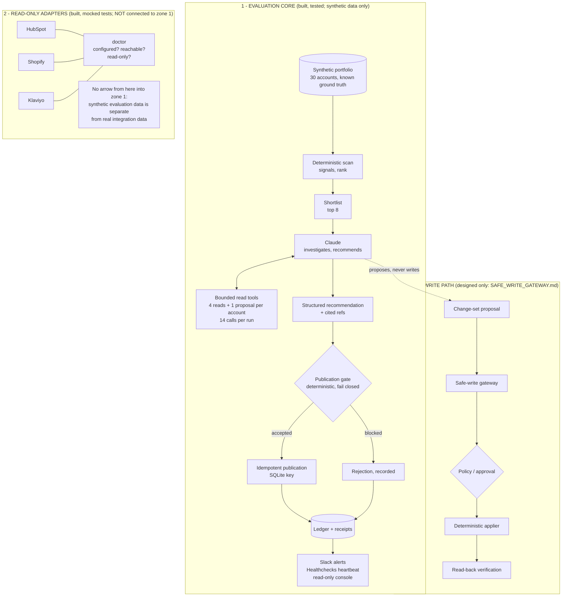

# Architecture

**The wall between zones 1 and 2 is deliberate.** The evals score the model
against a portfolio whose right answers are known. Real systems have no answer
key and change underneath you, so mixing them in would make a score drop
unexplainable. A test fails if anything outside `integrations/` imports the
lab (`tests/test_integrations.py`). Zone 3 shares zone 1's machinery (refs,
gate style, idempotency keys, ledger, monitoring) but has no code yet.

## Who decides what

| DETERMINISTIC (code) | LLM (Claude) | HUMAN |
|---|---|---|
| arithmetic: ROAS, deltas, cart volume | which extra context matters | policy: thresholds, allow-lists |
| scan and rank; shortlist | interpreting CRM notes (a customer's pause) | approving higher-risk actions |
| data freshness | weighing conflicting signals | ambiguous decisions |
| revenue reconciliation | explaining trade-offs | exception review (alerts, partial runs) |
| citation membership (ref issued for this account, this run) | drafting the recommendation and task text | |
| idempotency | | |
| authorization and account scope | | |
| optimistic concurrency (future) | | |
| write verification (future) | | |

## Where each piece lives

| Piece | File |
|---|---|
| Synthetic portfolio, planted situations | `src/revenue_agent/dataset.py` |
| Scan and shortlist | `signals.py`, `repository.py`, `reconciliation.py` |
| Agent loop, budgets, retries, guards | `agent.py`, `tools.py` |
| Publication gate, confidence | `guardrails.py`, `confidence.py` |
| Unattended run, invariants, idempotency, ledger, monitoring | `unattended.py` (docs: `UNATTENDED_MODE.md`) |
| Operator console (read-only) | `console.py` |
| Read-only adapters and doctor | `integrations/` (docs: `REAL_INTEGRATIONS.md`) |
| Future write path | `docs/SAFE_WRITE_GATEWAY.md` |
| Evals and live baselines | `evals/cases.yaml`, `evals/BASELINES.md` |
