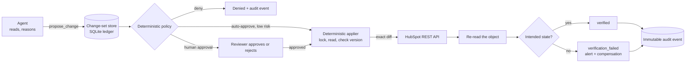

# Safe-write gateway (design only)

**Status: design. Nothing here is implemented.** Today the agent reads, and it
can propose a task that no business system ever sees. This note describes how
it could later change HubSpot without the model being able to damage the CRM.
The model proposes and explains. **It never performs a mutation.**

## What already exists to build on

| Existing mechanism | Where | Role in the gateway |
|---|---|---|
| `propose_crm_task` returns a `PROPOSED` record and writes nothing | `src/revenue_agent/tools.py:347` | becomes `propose_change`: same shape, richer diff |
| Account-scoped refs and provenance (`issue_ref`, `refs_for`) | `tools.py:227-243` | `evidence_refs` must be refs issued for the target account in this run |
| Account tools refused outside the shortlist (`AccountOutOfScope`) | `tools.py:200`, `tools.py:270` | cross-account change-sets are denied before policy runs |
| Deterministic publication gate, fail closed | `src/revenue_agent/guardrails.py:39` | the policy step is a second gate of the same kind |
| Business rules as code (`blocked_actions`, reconciliation and freshness bands) | `guardrails.py:129`, `config.py` | the policy reads facts; it never reads model prose |
| Idempotency key + SQLite `PRIMARY KEY` (`publication_key`, `publish`) | `src/revenue_agent/unattended.py:250-283` | the same pattern keys change-sets and apply attempts |
| Run ledger, post-run invariants, silent-success warning | `unattended.py:168`, `unattended.py:286` | audit events and write-run invariants live in the same ledger |
| Healthchecks + Slack, monitoring isolated from the job | `unattended.py:305-345` | verification failures alert the same way |

From production billing automation I ran before, five practices carry over:

- **Hard stop on ambiguity.** When the target is ambiguous, the change is denied and escalated. There is never a silent default.
- **Application-level idempotency keys.** The vendor is not trusted to deduplicate.
- **Item-level locks.** One writer per object at a time.
- **A human approval gate used as a monitoring period during rollout.** It is removed per change type once the data shows it is safe.
- **Post-write reconciliation and measured blast radius.** Every write is reconciled afterwards, and blast radius is measured on a small slice before anything touches the portfolio.

The human-approval step already exists, without an applier:
`python -m revenue_agent.review approve|reject <publication_key>` appends
an immutable decision to the ledger's `reviews` table (SQLite triggers refuse
edits and deletes), and an approval reads "approved, not applied: no applier
exists by design".

## Flow



## Change-set

```json
{
  "changeset_id": "cs_01J9Z3K8",
  "idempotency_key": "sha256(job|as_of|hubspot|company|48213|lifecyclestage|customer->evangelist)",
  "object_type": "company",
  "object_id": "48213",
  "diff": [{"field": "lifecyclestage", "from": "customer", "to": "evangelist"}],
  "evidence_refs": ["account_context:atlas_ivy", "account_activity:atlas_ivy"],
  "base_version": "2026-09-22T08:14:03.117Z",
  "risk_level": "high",
  "policy_result": "requires_human_approval",
  "proposed_by": "agent:run:a8fc88e6",
  "created_at": "2026-09-22T09:00:41Z",
  "approved_by": "thais",
  "approved_at": "2026-09-22T10:02:10Z",
  "apply_status": "applied",
  "verification_status": "verified",
  "rollback_plan": {"type": "restore_previous_value", "field": "lifecyclestage", "value": "customer"}
}
```

The model writes `diff`, `evidence_refs` and a rationale. Everything else is
written by deterministic code: `base_version` comes from the applier's own read
at proposal time, and `risk_level` and `policy_result` from the policy.

## Optimistic concurrency

At apply time the applier takes an item lock on `(object_type, object_id)` and
re-reads the object. If `current_version != base_version`, it does not
overwrite. The change-set moves to `expired`, and the agent may re-propose from
a fresh read. The rule is mechanical, never negotiated by the model.

HubSpot's object PATCH documents no conditional update (no `If-Match`), so the
check is check-then-write. The lock plus the post-write read-back close the gap
in practice. A concurrent human edit between the check and the PATCH shows up
as a verification mismatch, not as a silent overwrite.
**VERIFY AGAINST CURRENT HUBSPOT DOCUMENTATION BEFORE BUILDING:** which
property is the version (`updatedAt` / `hs_lastmodifieddate`), and whether a
conditional update exists.
(Checked: developers.hubspot.com/docs/api-reference/crm-companies-v3/basic/patch-crm-v3-objects-companies-companyId.
It lists no precondition header; the update needs `crm.objects.companies.write`.)

## Policy (DESIGN EXAMPLES, not calibrated values)

- **Scope:** the target must map to the change-set's account, and every
  `evidence_ref` must have been issued for that account (`refs_for`).
  Anything else is denied.
- **Property allow-list:** only listed properties can change at all. A
  protected list (financial identifiers, owner, billing IDs) is denied
  outright.
- **Bulk cap:** at most N applied changes per run (for example 10). Beyond the
  cap the run stops and alerts; it does not queue silently.
- **Rollout by blast radius:** a new change type starts auto-approve-off, on
  one account, then 5% of accounts, then everywhere. The approval gate is
  lifted per change type only after a clean verification record.
- **Dry run:** the applier can compute and log the exact request without
  sending it.
- **Levels:**
  - *Low risk, auto-approve:* create an internal follow-up task.
  - *Higher risk, human approval:* lifecycle stage, revenue fields, account
    status.
  - *Deny:* deletes, protected financial identifiers, cross-account mutation,
    an ambiguous or unresolved target, or a missing `base_version`.

## Applier

1. Lock the object.
2. Read the target.
3. Check `base_version`.
4. Send exactly the diff, and nothing the diff does not name.
5. Re-read the object.
6. Compare the intended state with the actual state, field by field.
7. Set `verification_status`.
8. Append the audit event.
9. Release the lock.

**A 2xx response alone is not proof of success.** Only the re-read decides
`verified`. The attempt is keyed by `idempotency_key`, so a retry after a crash
re-reads first and finds the change already applied instead of applying it
twice. This is the same crash-ordering rule publications use today (see
`docs/UNATTENDED_MODE.md`, section 6).

## Rollback and compensation

- **Reversible update:** write `from` back, as its own change-set, applied
  through the same applier.
- **Created task:** close or archive it, if policy permits.
- **Irreversible or unsafe operations** (deletes, merges, sends) are never
  auto-approved and have no automatic compensation.
- **Compensation is itself idempotent and audited.** A failed compensation
  alerts a human; it is never retried silently.

## Who decides what

| The LLM MAY | The LLM MUST NOT decide |
|---|---|
| gather context through read tools | whether a protected property is writable |
| propose a change-set | final authorization |
| summarize evidence, cite refs | how an ambiguous target is resolved |
| explain the rationale and trade-offs | idempotency |
| draft task or note text | version policy (overwrite or expire) |
| | whether verification succeeded |
| | whether a change can be rolled back |
| | bulk limits |

## Monitoring

- **Alerts:**
  - a `verification_failed` result alerts through Slack as `failed`
  - a compensation failure alerts too
  - a denied cross-account proposal is an operational safety event, and it
    alerts as well
- **Warning:** N consecutive write runs with 0 verified changes raise a
  warning, the same idea as today's `silent_success_streak`.
- **Heartbeat:** Healthchecks watches the write job exactly as it watches the
  daily run.
- **Invariants:** they gain write checks. The number of verified changes can
  never exceed the number of approved change-sets. No applied change may touch
  a property outside the allow-list.

## HubSpot notes

Every fact below is marked **VERIFY AGAINST CURRENT HUBSPOT DOCUMENTATION
BEFORE BUILDING.**

- A remote HubSpot MCP server became generally available in April 2026. VERIFY.
- It supports writes on contacts, companies, deals, tickets, line items and
  products. VERIFY.
- Quotes, invoices, subscriptions and campaigns are read-only. VERIFY.
- Authentication is OAuth 2.1 with PKCE. VERIFY.

On 2026-09-27, developers.hubspot.com/mcp said something different. It listed
invoices, quotes and subscriptions among the read/write objects, and it said
OAuth 2.0 today with OAuth 2.1 and PKCE "later in 2025". That is why every
fact above must be checked again.

**The architecture does not depend on MCP.** The applier calls the CRM REST API
directly. It is deterministic code with its own narrowly scoped private-app
token, and that token is never given to the model.

## Why this isn't built yet

The case first had to prove the parts that make a write trustworthy:

- deterministic detection
- bounded model reasoning
- evidence tracing
- publication gates
- evaluation against known ground truth
- unattended recovery
- monitoring

Real writes before those layers were trustworthy would have raised the blast
radius without improving how the agent's reasoning is evaluated. The gateway is
the next architecture step, and each layer it needs already exists here in
read-only form.
